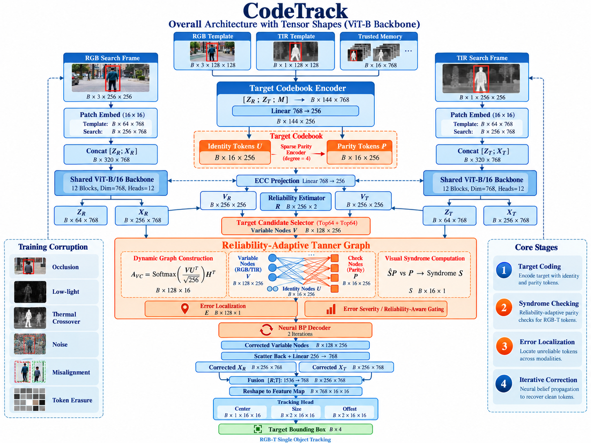

# CodeTrack

**Structured Redundancy and Syndrome-Guided Correction for Robust RGB-T Tracking**

CodeTrack formulates RGB-T single object tracking from an **error-correction perspective**: modality
degradation is treated as *structured corruption* of multimodal target representations, rather than
merely unreliable information to be suppressed.

The tracker keeps a learnable **Target Codebook** (identity tokens + sparse parity tokens), builds a
**Reliability-Adaptive Tanner Graph** over search-frame tokens, computes a **Visual Syndrome Map**,
localizes corrupted tokens through the sparsity of the graph, and repairs them with a **Neural
Belief-Propagation Decoder**.

```text
Fusion  ->  Verify  ->  Diagnose  ->  Correct  ->  Fuse
```

<p align="center">
  
</p>

---

## Overview

| Component | Responsibility |
|---|---|
| Shared ViT-B/16 Backbone | Patch embed (16x16) + 12 transformer blocks, weights pretrained |
| Target Codebook Encoder | `C_t = {U_t, P_t}`: `K=16` identity tokens + `M=16` sparse parity tokens (ECC projection `512 -> 256`) |
| Reliability Estimator | Per-token reliability `r_i` from RGB/T query, template and temporal consistency |
| Target Candidate Selector | Selects `N=256` variable nodes from RGB/T search tokens |
| Reliability-Adaptive Tanner Graph | Dynamic adjacency `A = softmax(U U^T / sqrt(d))`, sparse variable/check connectivity |
| Visual Syndrome Computation | `s_j = D(phi({v_i : i in N(j)}), p_j)`, yielding syndrome vector `S` (dim `1x16`) |
| Error Locator | Maps failing checks -> suspect variables and severity |
| Neural BP Decoder | 2 iterations of variable<->check message passing, residual correction |
| Fusion + Tracking Head | Residual add, reshape to feature map, FPN fusion, box head (`4x1x16x16`) |

Core stages: **Target Coding -> Syndrome Checking -> Error Localization -> Iterative Correction**.

---

## Repository layout

```text
CodeTrack/
├── assets/figures/        # architecture figures used by docs & README
├── codetrack/             # installable python package (all model & training code)
│   ├── models/            # network modules, one sub-package per architecture block
│   ├── data/              # datasets, transforms, corruption simulator, samplers
│   ├── engine/            # trainer / evaluator / losses / optim
│   ├── metrics/           # PR / SR / NPR and tracking metrics
│   ├── utils/             # config, logging, checkpoint, box ops, seeding
│   └── cli/               # train / eval / demo / export entry points
├── configs/               # yaml configs: model / data / corruption / experiment
├── scripts/               # thin shell wrappers (train.sh, eval.sh, ...)
├── tools/                 # data prep, weight download, smoke test
├── tests/                 # unit + integration tests
├── docs/                  # architecture, method, protocol, reproducibility, results
├── third_party/           # read-only reference implementations (GOLA / ViPT)
├── data/                  # dataset mount point (gitignored, symlink to lab/dataset)
├── checkpoints/           # model weights (gitignored)
├── outputs/               # logs, tensorboard, eval results (gitignored)
└── notebooks/             # exploration notebooks
```

---

## GitHub sync

Upstream repository: <https://github.com/yjfingit/CodeTrack>

Everything merged into `main` is pushed to `origin` automatically. A `post-commit`
hook pushes `HEAD` in the background (never blocks a commit, never opens a
credential prompt) and appends its output to `.git/push.log`.

```bash
bash tools/install-git-hooks.sh                # once per clone / container reset
bash tools/sync-to-github.sh "feat: something" # manual fallback: stage, commit, push
```

What gets pushed is exactly what `.gitignore` allows: source, configs, docs, tests.
Datasets, weights and run outputs are excluded by design.

Credentials are stored on the machine, never in the repository — see
[docs/reproducibility.md](docs/reproducibility.md#git-credentials).

On a fresh container the whole thing is restored with two commands (GitHub CLI lives on the data
disk, so `gh` and its token both survive a container reset):

```bash
bash tools/install-gh.sh         # download gh, symlink it, persist GH_CONFIG_DIR
bash tools/gh-login-device.sh    # device-code login -> open https://github.com/login/device
```

---

## Installation

```bash
git clone https://github.com/yjfingit/CodeTrack.git
cd CodeTrack

# python >= 3.10
python -m venv .venv && source .venv/bin/activate
pip install -r requirements.txt
pip install -e .
```

Development extras:

```bash
pip install -r requirements-dev.txt
pre-commit install
```

---

## Data preparation

Datasets are expected under `data/` (symlink to the persistent data disk):

```bash
ln -s /root/autodl-tmp/lab/dataset/LasHeR        data/LasHeR
ln -s /root/autodl-tmp/lab/dataset/RGBT234       data/RGBT234
```

Then generate manifests:

```bash
bash tools/prepare_data.sh
```

---

## Quick start

```bash
# 1. sanity check: 20-iteration smoke run on a tiny subset
bash tools/smoke_test.sh

# 2. train
bash scripts/train.sh configs/experiment/lasher_vitb.yaml

# 3. evaluate (PR / SR / NPR on LasHeR)
bash scripts/eval.sh configs/experiment/lasher_vitb.yaml checkpoints/lasher_vitb.pth

# 4. single-sequence demo
bash scripts/demo.sh --sequence data/LasHeR/test/<seq> --ckpt checkpoints/lasher_vitb.pth
```

Config inheritance is supported through `_base_`:

```yaml
# configs/experiment/lasher_vitb.yaml
_base_: ../model/vitb_codetrack.yaml
data:
  dataset: lasher
  root: data/LasHeR
train:
  epochs: 10
  batch_size: 8
```

---

## Corruption protocol

Robustness is measured under controlled, reproducible corruption at both image and token level.

| Level | Corruption |
|---|---|
| RGB channel | low-light, over-exposure, blur, occlusion, color degradation |
| Thermal channel | thermal saturation, thermal crossover, noise, contrast loss |
| Token channel | random erasure, burst erasure, feature noise |
| Cross-modal | spatial shift, scale shift, temporal delay |

Severity sweeps and the evaluation harness live in `configs/corruption/` and `codetrack/data/corruption/`.
See [`docs/corruption_protocol.md`](docs/corruption_protocol.md).

---

## Evaluation metrics

- **PR** — Precision Plot
- **SR** — Success Plot (AUC)
- **NPR** — Normalized Precision Plot

---

## Documentation

| Doc | Content |
|---|---|
| [docs/architecture.md](docs/architecture.md) | module-by-module architecture with tensor shapes |
| [docs/method.md](docs/method.md) | method & formulation (parity, syndrome, BP decoding) |
| [docs/corruption_protocol.md](docs/corruption_protocol.md) | corruption generation & evaluation protocol |
| [docs/reproducibility.md](docs/reproducibility.md) | seeds, hardware, expected numbers |
| [docs/results.md](docs/results.md) | main results & ablations |

---

## Contributing

See [CONTRIBUTING.md](CONTRIBUTING.md). Please run `make lint test` before opening a PR.

## License

Released under the [MIT License](LICENSE).

## Citation

```bibtex
@article{codetrack2026,
  title  = {CodeTrack: Structured Redundancy and Syndrome-Guided Correction for Robust RGB-T Tracking},
  author = {TODO},
  year   = {2026}
}
```
